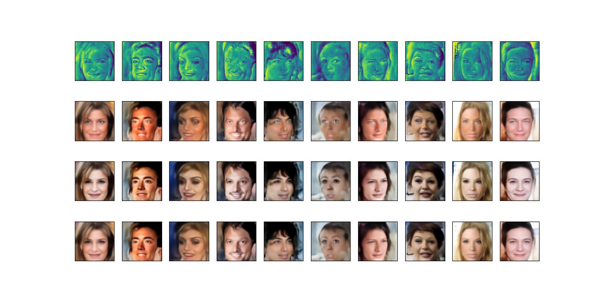

# Split-VAE
Split Variational AutoEncoder

## Introduction
This repository contains and implemementation of a Split Variational AutoEncoder (SVAE).
In a SVAE the output y is computed as a weighted sum 

sigma * y1 + (1-sigma) * y2

where y1 and y2 are two distinct generated images, and sigma is a learned compositional map. 

A Split VAE is trained as a normal VAE: no additional loss is added over the splitted images y1 and y2. 

Splitting is meant to offer to the network a more flexible way to learn fruitful and independent features: as a result the variable collapse phenomenon is greatly reduced 
and the possibility of exploiting a larger number of latent variables improves the quality and diversity of generated samples.

## Types of Splitting

The decomposition is nondeterministic, but follows two main schemes, 
that we may roughly categorize as either <em>syntactical</em> or <em>semantical</em>. 

### Syntactic decomposition
In this case, the compositional map tends to exploit the strong correlation between adjacent pixels, splitting the image in
two complementary high frequency sub-images. 

Below are some examples of syntatic splitting. In all the following pictures, the first row is the compositional map, thne in order y1, y2 and
y. 

	

	
	
### Semantic decomposition
	
In this case, the map typically
focuses on the contours of objects, splitting the image in
interesting variations of its content, with more marked and
distinctive features. 
	
Here are some examples of semantic splitting:

	
In case of sematic splitting, the Frèchet Inception Distance (FID) of y1 and y2 is usually lower (hence better) 
than that of y, that clearly suffers from being the average of the formers. 
	
In a sense, a SVAE forces the Variational Autoencoder to <em>make choices</em>, in contrast with its intrinsic tendency to <em>average</em> between alternatives with the aim to minimize the reconstruction loss towards a specific sample.	
	
## More examples of GENERATED images

Examples of Mnist-like gnerated digits (FID=7.47)
	

	
Here are some additional examples of semantic compositonal maps generated for CelebA, quite similar to drawings. The
quality and precision of contours is both unexpected and remarkable.
	

	
	
And some generated faces (FID=35.5).  Observe in particualr the
wide differentiation in pose, illumination, colors, age and expressions.
	

	
	
